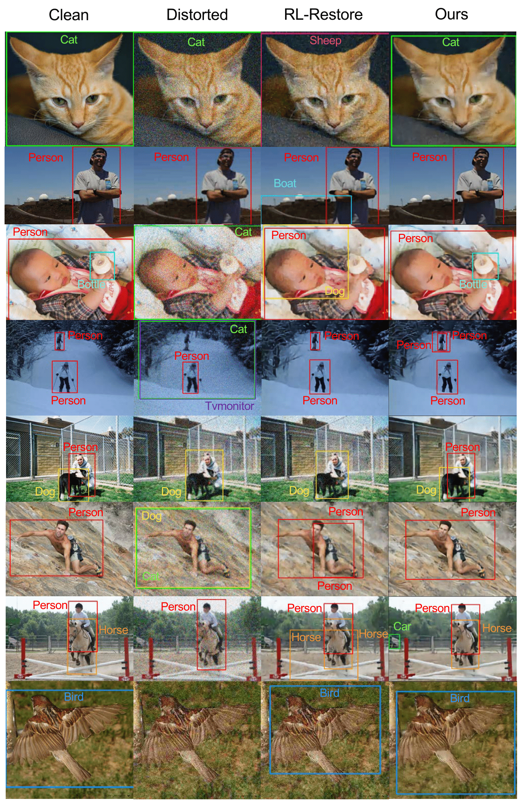

# Attention-based Adaptive Selection of Operations for Image Restoration in the Presence of Unknown Combined Distortions

This repository contains the code for the following paper:

Masanori Suganuma, Xing Liu, Takayuki Okatani, "Attention-based Adaptive Selection of Operations for Image Restoration in the Presence of Unknown Combined Distortions," CVPR, 2019. [[arXiv](https://arxiv.org/abs/1812.00733)]

If you find this work useful in your research, please cite:

    @inproceedings{suganumaCVPR2019,
        Author = {M. Suganuma and X. Liu and T. Okatani},
        Title = {Attention-based Adaptive Selection of Operations for Image Restoration in the Presence of Unknown Combined Distortions},
        Booktitle = {CVPR},
        Year = {2019}
    }


Sample results on image restoration: 


Sample results on object detection: 




## Requirement

* Ubuntu 16.04 LTS
* CUDA version 10.0
* Python version 3.6.2
* PyTorch version 1.0


## Usage

### Train a model on the dataset proposed by [RL-Restore](https://arxiv.org/abs/1804.03312)

```shell
python main.py -m mix -g 1
```

When you use the multiple GPUs, please specify the number of gpus by `-g` option (default:1)
#### Dataset

The dataset used in [RL-Restore](https://arxiv.org/abs/1804.03312) is available [here](https://github.com/yuke93/RL-Restore).
To generate the training dataset, please run `data/train/generate_train.m` in the above repository and put the generated file (train.h5) to `dataset/train/` in your computer.

### Train a model on your own dataset

```shell
python main.py -m yourdata -g 1
```


### Test

Put the trained model (XXXX.pth) to `Trained_model/`, and run the following code:

```shell
python test.py -m mix -g 1
```
